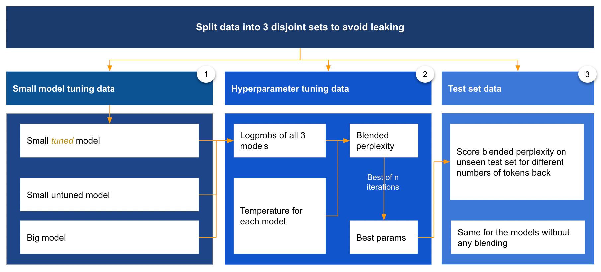
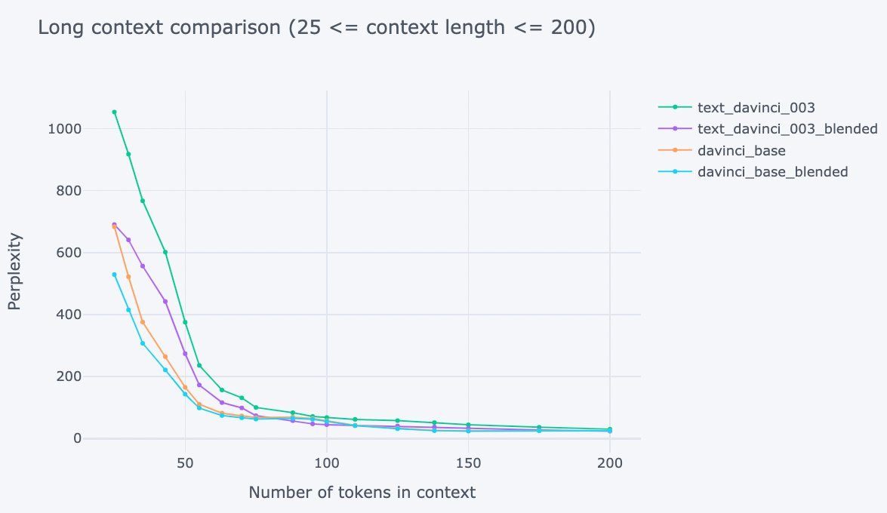
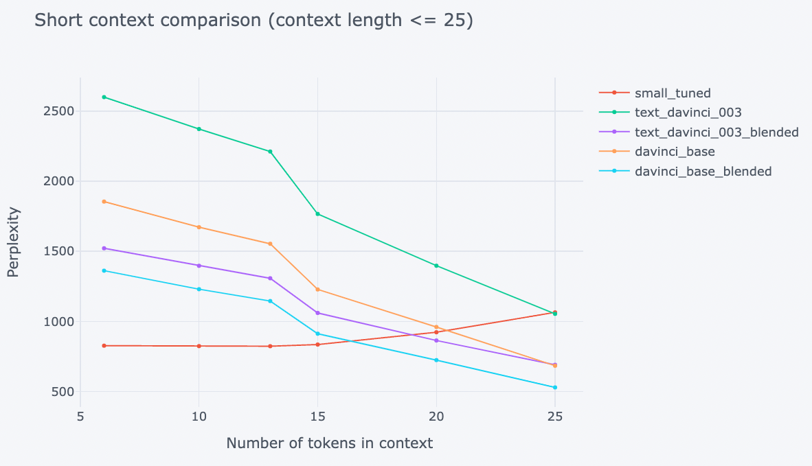

# Approximating Finetuning

## Intro

We might not have access or time to directly finetune state of the art models. It is pretty accessible to finetune small models, however, and so the question is: Can we get some of the benefits from finetuning by using a small finetuned model to "steer" a larger model's generations?

We therefore build a system composed of 3 models:
1) Small untuned: A base Babbage model (no finetuning)
2) Small tuned: A finetuned Babbage model
3) Big: GPT-3 base model or text-davinci-003

Next we find some way to gently nudge the generations of GPT-3 by measuring the difference between the two Babbage models, and applying it directly to the GPT-3 logits (unsure exactly how, and this might require some empirical exploration). We could also maybe do some kind of local search using the Babbage models (since they are really cheap to run), and use the results of that search to inform the GPT-3 generation.
The goal is to build a composite system which is more useful to generate from than any of the 3 models on their own.

A conceptual overview of the project is provided by this flow chart:


## Example results and conclusions
Some example result plots:



Conclusions so far are:
- The blending approach does seem to work and beat text-davinci-003 and davinci base on their own
- Blending with davinci base model seems slightly better than with text-davinci-003
- The small tuned model is best at very short number of tokens back, because it already comes with a preference of the style of these books rather than requiring more nudging by the text context

## Create virtualenv, activate it and install dependencies
First make sure you are in the root folder of this repo, then in the terminal:
```bash
python3 -m venv .pyenv  # Create virtual environment
source .pyenv/bin/activate  # Activate the virtual environment
# source .pyenv/Scripts/activate  # Activation if on Windows
pip install --upgrade pip  # Upgrade if old version of pip
pip install -e .  # Install requirements of the module
pip install ."[dev, test]"  # Syntax for installing optional requirements of module
```

## Prepare environment for openai
- In OpenAIs graphical interface, make sure to set right default organization if you want to tune your own small model on a specific org
- Add your OpenAI API key to a .env file inside the approximating_finetuning folder, in the style of: API_KEY=your_key
- For input datasets, they are available here: - https://drive.google.com/drive/folders/1TkWVsu7PVFBGEAYV-11x-yxzEx6Gt7ka?usp=sharing
  - fairytales.txt 
    - is the original childrens books dataset we use. It comes from kaggle (https://www.kaggle.com/datasets/edenbd/children-stories-text-corpus?resource=download)
    - used for the first step which is to finetune a small model
  - The pickle files in text-davinci-003 is the API results from the first notebook, [01-data-prep-notebook](01-data-prep-notebook), and they also contain the davinci base model results that we later override with for comparison
  - Put the data in approximating_finetuning/data/ if you want to use it rather than querying your own results

## Use notebooks that are .py files
Assuming you've installed the dependency for Jupytext from requirements, you can then:
- Launch jupyterlab from the terminal
- Right click a .py file that is notebook --> Open with --> Jupytext Notebook. You should then see it as a regular .ipynb style notebook but the git diffs will be clean.

## Overview of the flow and notebooks
0) If starting completely from scratch, the first step is to fine tune a small model. In that case, use the execute-fine-tuning.sh bash script that prepartes the txt file into the format the tuning api wants, and starts the tuning. (Else if you have access to a tuned small model through your organization you can just use it by setting default org in the OpenAI graphical interface.)

1) The first notebook, [01-data-prep-notebook](01-data-prep-notebook), is for:
   - Calling the openai api to get the logprobs for the 3 models for lots of examples in the test set part of the input data
   - These are the raw API results of logprobs per model. To avoid any side effects we dont do any alignment or normalization of the logprobs here, only in the blending pipeline.

2) The second notebook, [02-tuning-notebook.py](02-tuning-notebook.py), uses the hyperparamter tuning library Optuna to fine tune the input parameters for the blending pipeline to achieve the best perplexity
   - Here we split the test dataset once more into validation and test, so that we dont leak any information from the final test set into the tuning.
   - This applies also to the third notebook
   
3) The third notebook, [03-blending-notebook.py](03-blending-notebook.py), is for:
   - Applying the blending pipeline to the test set, using the best params from the tuning notebook
   - Creating plots of the results, slicing perplexity over different number of tokens back in the input context to the models

4) Bonus: The fourth notebook, [04-generate-example-text-notebook.py](04-generate-example-text-notebook.py), is for generating example text using the fine tuned blending params for qualitative evaluation
   - You decide some arbitrary starting prompt in the style of childrens books if that is what you've tuned for 
   - It also has a section for comparing with the non-blended big model